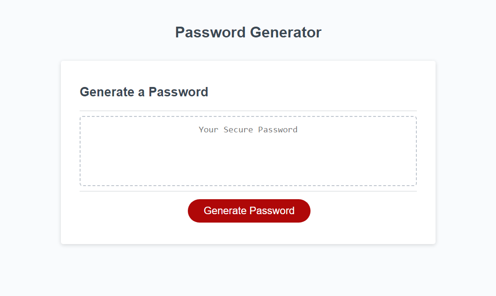

## Password Generator

# Description

The goal of this web application was to generate a randomized password with parameters set by the user. These parameters included password length and the inclusion of lowercase, uppercase, numeric, and special characters. This project was a practical application of many JavaScript concepts. I learned how to ulitlize arrays, functions, if-else statements, for loops and more to accomplish this goal. 

# Technologies Used

* HTML
* JavaScript

# Links

[Repository](https://github.com/n810tran/password-generator)

[Deployed Site](https://n810tran.github.io/password-generator/)

# Preview

